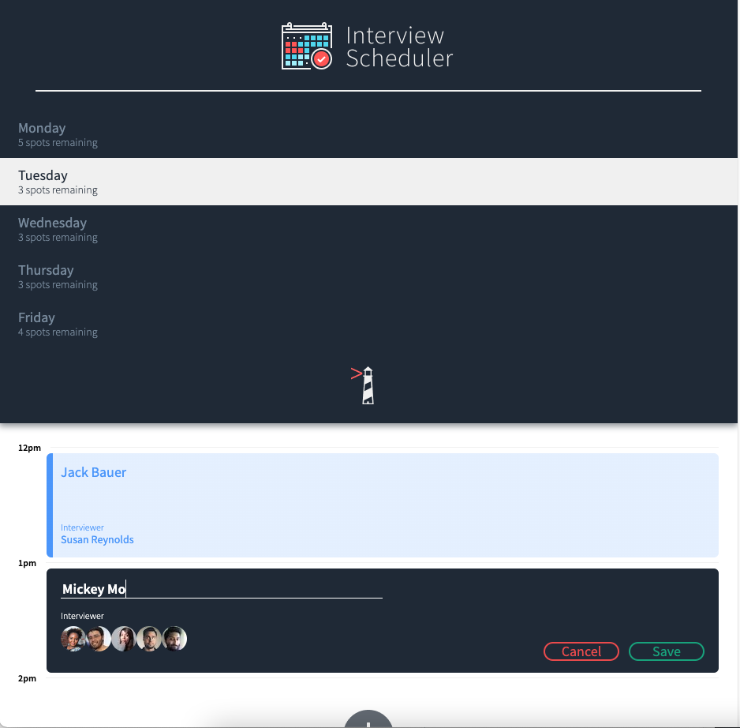
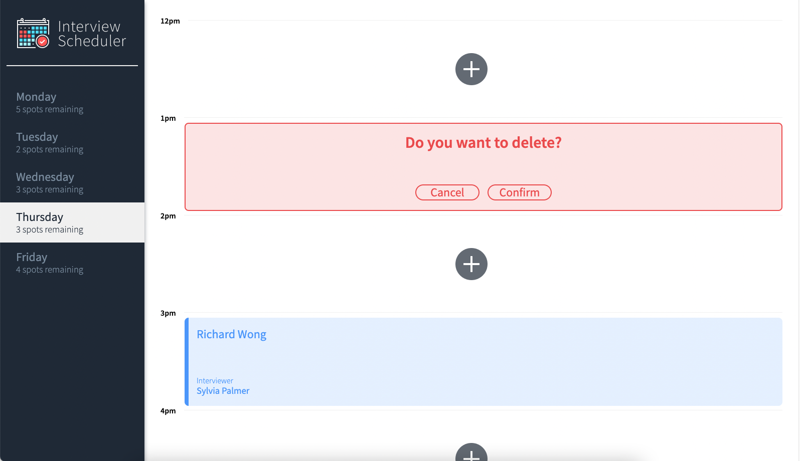

# Interview Scheduler

Interview Scheduler is a single-page application (SPA) that allows users to book technical interviews between students and mentors. Appointments can be between the hours of 12 PM and 5 PM, Monday to Friday. Appointments can also be edited or deleted. The front end of this project is built with React and makes requests to an API to fetch and store appointment data from a database.

## Images




## Stack

React
Webpack
Axios
Storybook, Webpack Dev Server, Jest, Cypress

## Setup

Install dependencies with `npm install`.

## Running Webpack Development Server

```sh
npm start
```

## Running Jest Test Framework

```sh
npm test
```

## Running Storybook Visual Testbed

```sh
npm run storybook
```

## API

https://github.com/lighthouse-labs/scheduler-api
